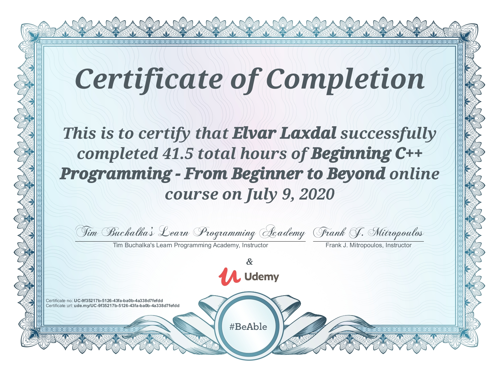

# Beginning C++ Programming - From Beginner to Beyond
All coursework for the Beginning C++ Programming - From Beginner to Beyond by Tim Buchalka and Frank J. Mitropoulos.

[The Course at Udemy](https://www.udemy.com/course/beginning-c-plus-plus-programming/)   
[The Learn Programming Academy](http://learnprogramming.academy)

## Curriculum

- [x] Section 01 - Introduction
- [x] Section 02 - Installation and Setup
- [x] Section 03 - Curriculum Overview
- [x] Section 04 - Getting Started
- [x] Section 05 - Structure of a C++ Program
- [x] Section 06 - Variables and Constants
- [x] Section 07 - Arrays and Vectors
- [x] Section 08 - Statements and Operators
- [x] Section 09 - Controlling Program Flow
- [x] Section 10 - Characters and Strings
- [x] Section 11 - Functions
- [x] Section 12 - Pointers and References
- [x] Section 13 - OOP - Classes and Objects
- [x] Section 14 - Operator Overloading
- [x] Section 15 - Inheritance
- [x] Section 16 - Polymorphism
- [x] Section 17 - Smart Pointers
- [x] Section 18 - Exception Handling
- [x] Section 19 - I/O and Streams
- [x] Section 20 - The Standard Template Library (STL)
